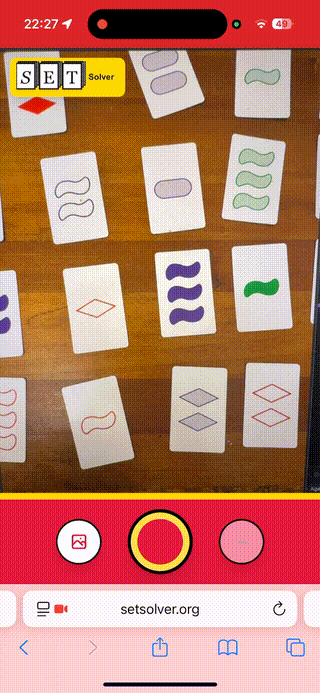
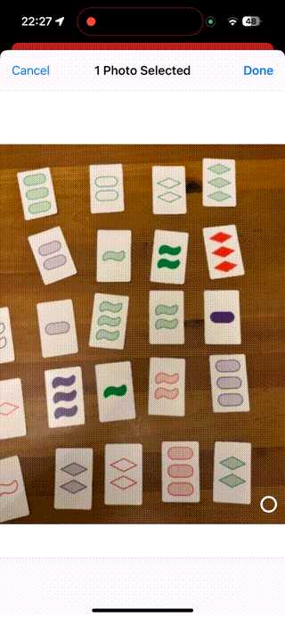

<div align="center">


<br />

[](https://setsolver.org)

<br />


<br />

Point your camera at SET cards or upload a photo. All valid SETs are found instantly.

[Try the App](https://setsolver.org) · [How It Works](#how-it-works) · [Run Locally](#quick-start)

</div>

---

## Capture with Camera

<div align="center">



</div>

## Upload image

<div align="center">



</div>

## Quick Start

```bash
bun install
bun run dev
```

Open http://localhost:5173

### Build

```bash
bun run build
```

---

## How It Works

1. **Detection** — OpenCV finds card contours in the image
2. **Classification** — Neural network identifies shape, color, number, shading
3. **Solving** — Algorithm finds all valid SETs

---

## Project Structure

```
src/
├── components/    # Camera, Canvas, Controls
├── hooks/         # useSetSolver
├── analysis/      # OpenCV detection + ONNX inference
└── game/          # SET logic & solver

public/models/     # Pre-trained classifier
classifier/        # PyTorch training notebook
```

---

## Retrain (Optional)

```bash
cd classifier && uv sync
uv run jupyter notebook classifier.ipynb
```

Headless (no UI):

```bash
cd classifier && uv sync
uv run jupyter nbconvert --to notebook --execute classifier.ipynb --output classifier.executed.ipynb
```

---

<div align="center">

[**Try SET Solver →**](https://setsolver.org)

MIT License

</div>
